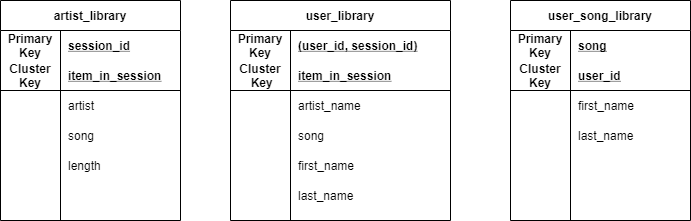

## Introduction
A startup called Sparkify has been collecting data on songs and user activity in JSON format. They are interested in efficiently performing 
song play analysis. Specifically, they want to know which songs do users prefer.

## About the Source Data
The dataset has been gathered from [Million Songs Dataset](https://labrosa.ee.columbia.edu/millionsong/) and logs simulated using 
[event simulator](https://github.com/Interana/eventsim)

## Project Description

In this project the objective is to use [Apache Cassandra](https://cassandra.apache.org/) to model the following queries

1. Give me the artist, song title and song's length in the music app history that was heard during sessionId = 338, and itemInSession = 4
2. Give me only the following: name of artist, song (sorted by itemInSession) and user (first and last name) for userid = 10, sessionid = 182
3. Give me every user name (first and last) in my music app history who listened to the song 'All Hands Against His Own'

## Database Design

In Cassandra tables are  modelled after queries (i.e. minimizing partition read and spreading data evenly), for more information check [here](https://www.datastax.com/blog/basic-rules-cassandra-data-modeling).

## Sample SQL
~~~~sql
SELECT first_name, last_name 
FROM user_song_library 
WHERE song='All Hands Against His Own';
~~~~

This query would return the first_name, and last_name of users that listened to 'All Hands Against His Own' songs.

## Usage

Run all the cells of the `project.ipynb` notebook
